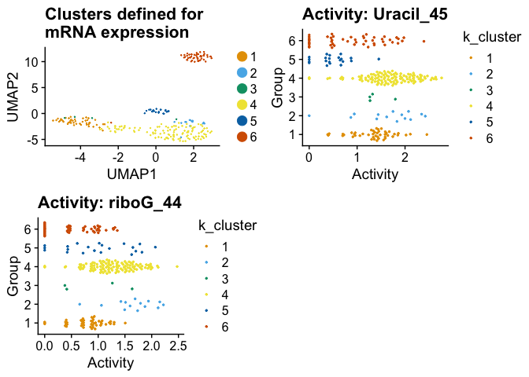

<!-- README.md is generated from README.Rmd. Please edit that file -->

# scrunchy 

[](https://travis-ci.org/hesselberthlab/scrunchy)
[](https://codecov.io/gh/hesselberthlab/scrunchy?branch=master)
[](https://www.tidyverse.org/lifecycle/#experimental)

scrunchy provides analysis tools for the **S**ingle-**c**ell
**r**econstruction of f**unc**tional **h**eterogeneit**y**
(**scrunchy**).

Most single-cell analysis experiments provide information about the
abundance of molecules in a cell (e.g., mRNAs). We have expanded the
capability of single-cell mRNA sequencing experiments to also recover
**functional** information—i.e. the activites of enzymes in single
cells.

## Installation

Install the R package:

``` r
# install.packages("remotes")
remotes::install_github("hesselberthlab/scrunchy")
```

# Example

An example data set (`fsce_small`) in scrunchy includes:

  - A single-cell mRNA sequencing experiment (10x Genomics 3prime V2)

  - Counts of DNA repair on synthetic DNA substrates containing a uracil
    (A:U) and a ribonucleotide (rG:C).

`fsce_small` object now contains mRNA expression (`SCERnaSeq`) and DNA
repair activity (`SCEHaircut`) for 250 cells.

``` r
library(scrunchy)

fsce_small
#> A FunctionalSingleCellExperiment object of 2 listed
#>  experiments with user-defined names and respective classes. 
#>  Containing an ExperimentList class object of length 2: 
#>  [1] rnaseq: SingleCellExperiment with 9479 rows and 250 columns 
#>  [2] haircut: SingleCellExperiment with 426 rows and 250 columns 
#> Features: 
#>  experiments() - obtain the ExperimentList instance 
#>  colData() - the primary/phenotype DataFrame 
#>  sampleMap() - the sample availability DataFrame 
#>  `$`, `[`, `[[` - extract colData columns, subset, or experiment 
#>  *Format() - convert into a long or wide DataFrame 
#>  assays() - convert ExperimentList to a SimpleList of matrices
```

These plots illustrate:

1.  Two-dimensional embedding of cells defined by UMAP (`umap::umap()`)
    and colored by k-means clustering (n = 6)

2.  Activities on a U:A and riboG DNA hairpins.


