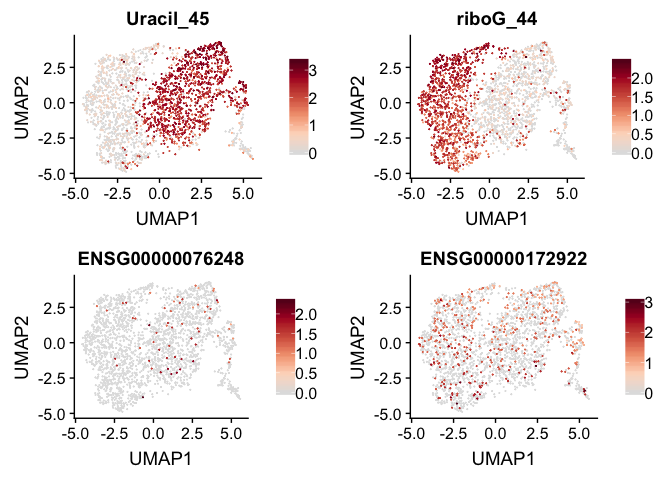

<!-- README.md is generated from README.Rmd. Please edit that file -->

# scrunchy 

[](https://travis-ci.org/hesselberthlab/scrunchy)
[](https://codecov.io/gh/hesselberthlab/scrunchy?branch=master)

scrunchy provides analysis tools for the **S**ingle-**c**ell
**r**econstruction of f**unc**tional **h**eterogeneit**y**
(**scrunchy**).

Most single-cell analysis experiments provide information about the
abundance of molecules in a cell (e.g., mRNAs). We expanded the
capability single-cell mRNA sequencing experiments to recover
**functional** information—i.e. the activites of cellular enzymes.

## Installation

Install the R package:

``` r
devtools::install_github("hesselberthlab/scrunchy")
```

# Example

An example data set in scrunchy includes:

  - A single-cell mRNA sequencing experiment (10x Genomics 3prime V2)

  - Counts of DNA repair on synthetic DNA substrates containing a uracil
    (A:U) and a ribonucleotide (rG:C).

<!-- end list -->

``` r
library(scrunchy)
library(SingleCellExperiment)

# load mRNA UMI data
exp <- load_csv(scrunchy_data("mrna.csv.gz"))

# load haircut UMI data
fxn <- load_csv(scrunchy_data("haircut.csv.gz"))

fce <- create_fce(exp, fxn)
```

The `fce` object now contains counts for mRNA expression and DNA repair
activity for each cell.

``` r
fce
#> A MultiAssayExperiment object of 2 listed
#>  experiments with user-defined names and respective classes. 
#>  Containing an ExperimentList class object of length 2: 
#>  [1] sce: SingleCellExperiment with 33694 rows and 2255 columns 
#>  [2] fsce: SingleCellExperiment with 122 rows and 2255 columns 
#> Features: 
#>  experiments() - obtain the ExperimentList instance 
#>  colData() - the primary/phenotype DataFrame 
#>  sampleMap() - the sample availability DataFrame 
#>  `$`, `[`, `[[` - extract colData columns, subset, or experiment 
#>  *Format() - convert into a long or wide DataFrame 
#>  assays() - convert ExperimentList to a SimpleList of matrices
```

We can normalize this data, calculate a two-dimensional projection of
the mRNA data using `umap::umap()`, and superimpose DNA repair activity.

``` r
fce <- normalize_counts(fce)

var_genes <- get_var_genes(fce, n_genes = 5000) 
fce <- calc_pca(fce, n_pcs = 20, genes = var_genes)
#> scaling data
#> calculating pcs
fce <- calc_umap(fce, n_dims = 6)

features <- c(
  "Uracil_45",
  "riboG_44",
  "ENSG00000076248",
  "ENSG00000172922"
)

plot_cells(fce, features)
```


