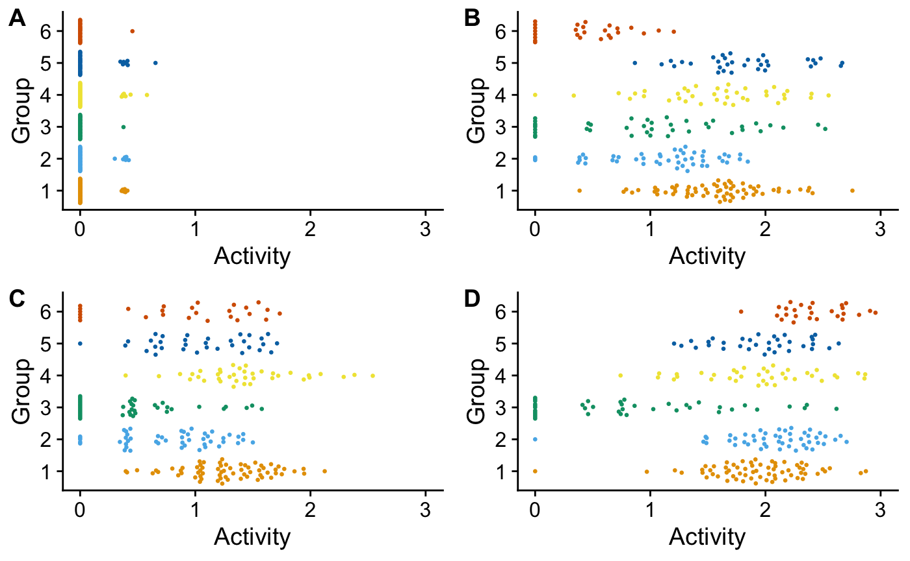

<!-- README.md is generated from README.Rmd. Please edit that file -->

# scrunchy 

[](https://travis-ci.org/hesselberthlab/scrunchy)
[](https://codecov.io/gh/hesselberthlab/scrunchy?branch=master)
[](https://www.tidyverse.org/lifecycle/#experimental)
[](https://cran.r-project.org/package=scrunchy)

scrunchy provides analysis tools for the **s**ingle-**c**ell
**r**econstruction of f**unc**tional **h**eterogeneit**y**.

New methods to study heterogeneity at cellular resolution in complex
tissues are rapidly transforming human biology. These methods measure
differences in gene expression, chromatin accessibility, and protein
levels across thousands of cells to understand developmental
trajectories of tissues, tumors, and whole organisms. However, their
reliance on measurements of steady-state abundance of DNA, RNA, and
protein limits our ability to extract dynamic information from single
cells.

To propel the study of heterogeneity among single cells, we are
developing functional assays as a new modality for single-cell
experiments. Instead of measuring the molecular abundance of DNA, RNA,
or protein in single cells and predicting functional states, our key
innovation is to directly measure enzymatic activities in single cells
by analyzing the conversion of substrates to products by single-cell
extracts in a high-throughput DNA sequencing experiment.

### Functional heterogeneity of DNA repair in immune cells

Our first functional method simulatneously measures the activity of DNA
repair enzymes and the abuncance of mRNAs from thousands of single
cells. We capture DNA repair activities by encapsulating synthetic DNA
oligonucleotides with defined lesions with single cells. Cellular repair
factors recognize and catalyze incision of these substrates, which we
subsequently capture in a modified library construction protocol.

An example data set in scrunchy contains a subset of data from an
experiment in which we simultaneously measure mRNA expression and DNA
repair activity in thousands of single cells (human primary mononuclear
blood cells).

This plots show cells classified by mRNA expression for each cell type.


These plots show measured DNA repair activities measured for each
cluster above. The repair substrates included an unmodified DNA
substrate (**A**), uracil base excision (in **B**, an A:U base-pair),
ribonucleotide excision (in **C**, a rG:C base-pair), and abasic site
repair (n **D**, abasic:C).



### Installation

scrunchy is under active development. You can install the R package from
github:

``` r
# install.packages("remotes")
remotes::install_github("hesselberthlab/scrunchy")
```
