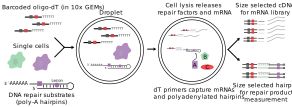

```{r echo=FALSE}
knitr::opts_chunk$set(
  echo = TRUE,
  out.width = "100%"
)
```

The goal of scrunchy is to facilitate the analysis of experiments that measure the heterogeneity of enzymatic activities among single cells.

We have developed functional assays as a new modality for single-cell experiments. These assays measure the conversion of substrates to products by single-cell extracts in a high-throghput DNA sequencing experiment. The assays are performed in the context of traditional single-cell mRNA sequencing experiment, enabling type identifcation and functional assessment of single cells. Our initial efforts have focused on measuring DNA repair activities in single cells and we are developing methods for other enzymes including proteases and kinases. Together these assays provide a new type of information from single-cell experiments.

The method to measure DNA repair enzymes takes advantage of the fact that nearly all DNA repair initiates with strand incision. By including synthetic polyadenylated DNA hairpins containing defined lesions, we can measure the number of incisions by cellular DNA repair factors in a high-throughput DNA sequencing experiment.  Because we are measuring strand incision on DNA hairpins, we call the assay Haircut---and scrunchy keeps track of your Haircut experiments. The following figure provides an overview of the method.

```{r overview_fig, echo=FALSE, out.width='100%'}

```

## Overview 

scrunchy facilitates the analysis and visualization of combined functional and transcriptome data from single cells.

1. Processing
1. Statistical analysis
1. Visualization

## The Functional Single Cell Experiment (fsce)

`fsce` is an object of class `FunctionalSingleCellExperiment`, which can contain data from multiple modalities and does not require that each modality has the same number of cells or features. It is a thin wrapper around [`MultiAssayExperiment::MultiAssayExperiment`].

A `FunctionalSingleCellExperiment` contains one or more objects of class [`SingleCellExperiment`], which contain observations and derived measurements that are linked by barcodes attached during sample work-up.

scrunchy contains a subset of cells from an experiment to measure gene expression and DNA repair activities in human peripheral blood mononuclear cells.

```{r fsce}
library(scrunchy)
fsce_small
```

### Individual experiments

```{r slots, message=FALSE, warning=FALSE}
library(SingleCellExperiment)

# `rnaseq` stores RNA info
fsce_small[["rnaseq"]]

counts(fsce_small[["rnaseq"]])[1:5, 1:5]

# `haircut` stores functional data
fsce_small[["haircut"]]

counts(fsce_small[["haircut"]])[1:5, 1:5]

# row annotations contain info about each row in the matrix
rowData(fsce_small[["haircut"]])

# column annotations contain info about each row in the matrix, 
# or about each unique cell present in any of the experiments
colData(fsce_small)
```

# Plots

`plot_hairpin` produces a coverage plot across each hairpin in the data.

```{r hairpin_plot}
plot_hairpin_coverage(fsce_small)
```

# Normalization

Normalized data is calculated by the `create_` functions.

RNA data is log-normalized and scaled to total UMI count for each cell. Functional data is normalized using the center log ratio method used for CITE-seq analysis.

Normalized data is stored in the `logcounts` slot of each `SingleCellExperiment` object.

```{r logcounts}
logcounts(fsce_small[["haircut"]])[1:5, 1:3]
```

# Feature selection and PCA

```{r pca}
# get variable genes
var_genes <- calc_var_features(fsce_small, n = 1000) 

# calc PCA and embed in 2D
fsce <- calc_pca(fsce_small, n_pcs = 20, genes = var_genes)
```

# Embed cells in 2D using UMAP or tSNE

```{r 2d}
fsce <- calc_umap(fsce_small, n_dims = 6)

fsce <- calc_tsne(fsce_small, n_dims = 6)
```

Cell embeddings are stored in the `reducedDims` slot of the `SingleCellExperiment` and can be accessed as a named list.

```{r rds}
reducedDims(fsce[["rnaseq"]])

reducedDims(fsce[["rnaseq"]])$UMAP[1:4, ]
```

# Tidying data for analysis and plotting

Several `tidy_` functions are provided to convert `fsce` into a tidy format.

```{r tidy}
library(dplyr)
library(purrr)

fsce_tidy <- purrr::reduce(
  list(
    tidy_dims(fsce_small) %>%
      select(cell_id, starts_with("UMAP"), -experiment),
    tidy_coldata(fsce_small),
    tidy_logcounts(fsce_small[c("Uracil_45", "riboG_44"), , ]) %>%
      select(-experiment)
  ),
  left_join,
  by = "cell_id"
)

fsce_tidy
```

# Visualization

## Two-dimensional embeddings

Features can be visulized on a two-dimensional embedding with the `plot_dims()` function which will plot gene/function assay values.

```{r plot_dims}
cowplot::plot_grid(
  plot_dims(fsce_tidy, UMAP1, UMAP2, Uracil_45, size = 1),
  plot_dims(fsce_tidy, UMAP1, UMAP2, riboG_44, size = 1)
)
```

## Functional activities

Activities can be visualized per-group with `plot_actvitiy()`. These two plots have uracil and ribonucleotide excision activities plotted per cluster (k-means, n = 6).

```{r plot_activity}
cowplot::plot_grid(
  plot_activity(fsce_tidy, Uracil_45, k_cluster),
  plot_activity(fsce_tidy, riboG_44, k_cluster)
)
```

## Heatmap

These heatmaps show uracil and ribonucleotide excision activities for the U:A and riboG hairpins

```{r heatmap_uracil}
mtx <- logcounts(fsce_small[["haircut"]])

rows <- paste("Uracil", 1:61, sep = "_")
plot_heatmap(mtx, rows, name = "Uracil")
```

```{r heatpmap_riboG}
rows <- paste("riboG", 1:61, sep = "_")
plot_heatmap(mtx, rows, name = "riboG")
```

# Appendix

### Loading data

```{r create_fsce_small, message=FALSE, eval=FALSE}
library(scrunchy)

# this same object is available as `fsce_small` in the package.
fsce <- create_fsce(
  list(
    rnaseq = create_sce_rnaseq(scrunchy_data("mrna")),
    haircut = create_sce_haircut(scrunchy_data("haircut"))
  )
)

fsce
```

